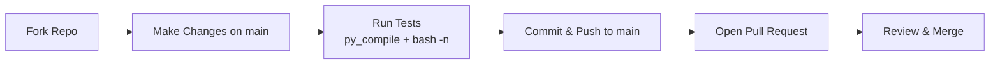

# MailSpoof — Contributing Guide

> Professional Email Spoofing and Phishing Simulation Framework
>
> Guidelines for contributing code, reporting bugs, and submitting pull requests.

Thank you for your interest in contributing!

## Contribution Workflow

## How to Contribute

1. Fork the repository
2. Edit files directly on the `main` branch
3. Commit your changes (`git commit -m "Add feature"`)
4. Push to your fork (`git push origin main`)
5. Open a Pull Request from `main`

## Branching Policy

MailSpoof uses a **single-branch model**.

- Only the `main` branch exists and is active
- Do not create feature branches (`git checkout -b` is not used)
- Do not create release branches
- All changes go through Pull Requests from `main`

## Requirements

- Python 3.8+
- Follow existing code style
- Run `python -m py_compile lib/*.py` before submitting
- Ensure `bash -n install.sh` passes

## Legal

By contributing, you agree that your contributions will be licensed under the Apache-2.0 License.
