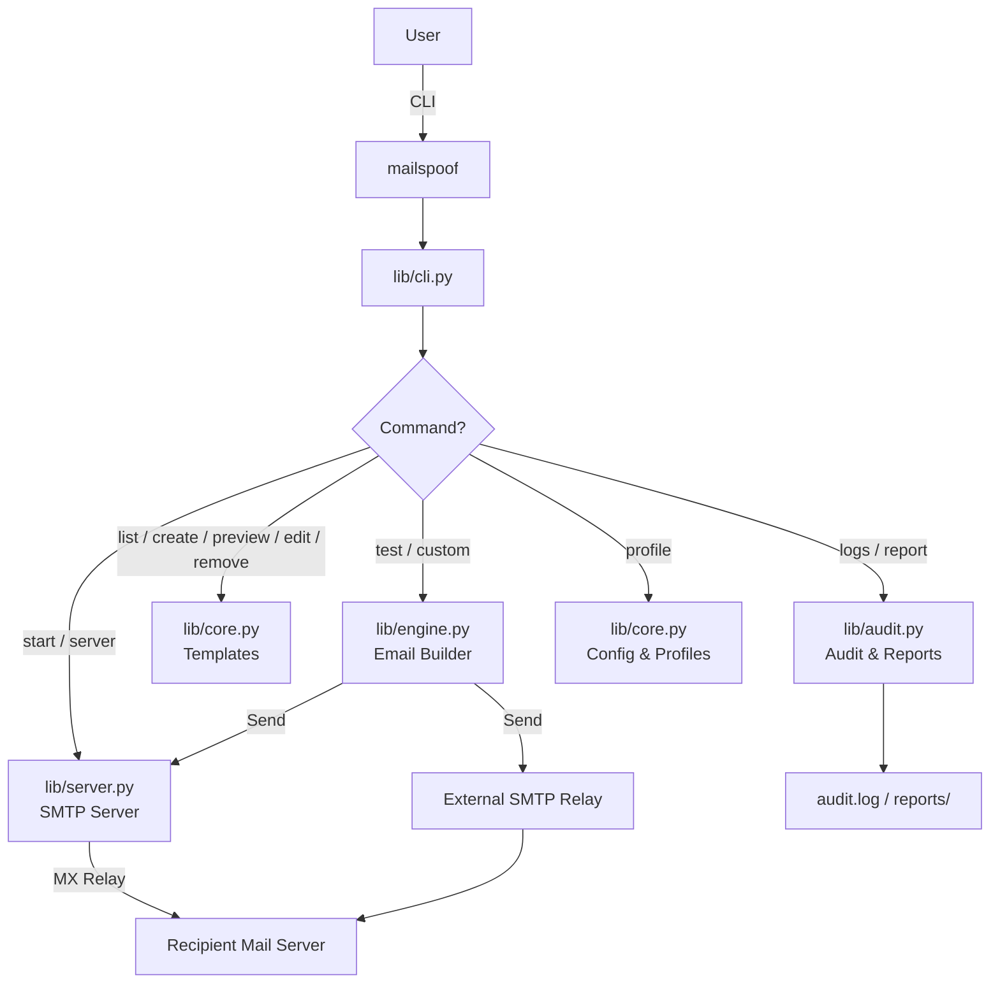
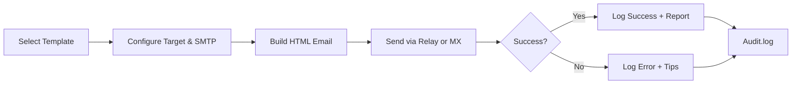
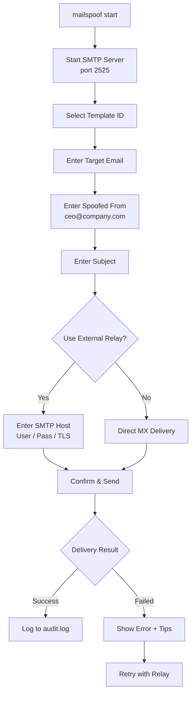
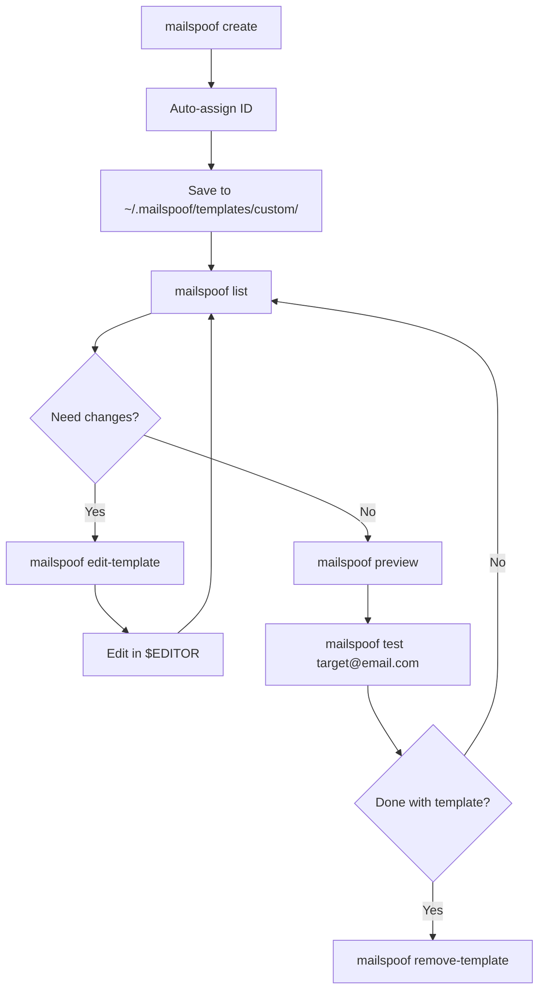
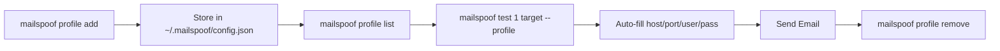
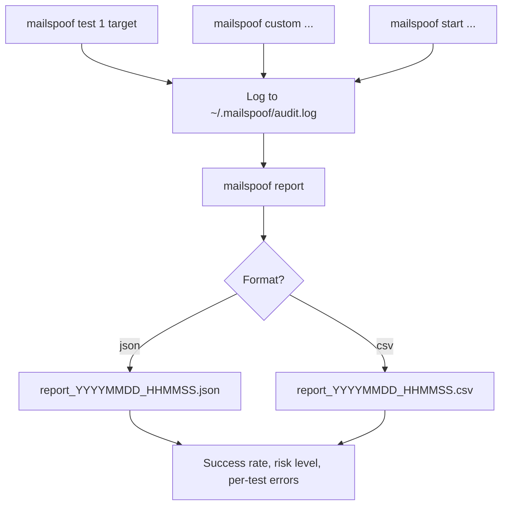
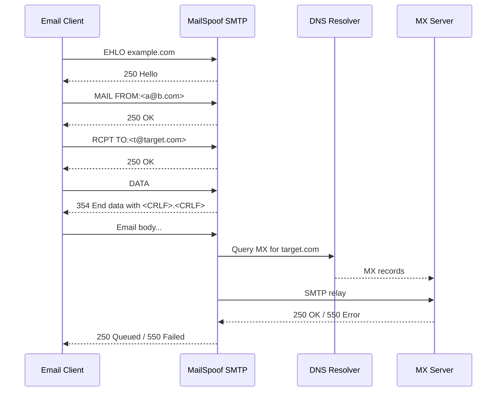

<div align="center">

| ✅ **Issue Resolved** |
| :--- |
| Thank you for your patience! The installation issues have been resolved. All fixes are live and the tool is fully operational. |

</div>


<p align="center">
  
</p>

<div align="center">

# MailSpoof — Email Spoofing & Phishing Simulation Tool

[](LICENSE)
[](https://www.python.org/downloads/)
[](https://github.com/syed-sameer-ul-hassan/MailSpoof/releases)
[](https://github.com/syed-sameer-ul-hassan/MailSpoof/releases)
[]()
[]()
[](SECURITY.md)

</div>

---


**MailSpoof** is a professional, open-source email spoofing and phishing simulation framework for authorized penetration testing, red team exercises, and security awareness training. Built in Python with a built-in SMTP testing server, pre-built attack scenarios, custom template creation, audit logging, and report generation.

---

## Table of Contents

- [Features](#features)
- [Technology Stack](#technology-stack)
- [How It Works](#how-it-works)
- [Quick Start](#quick-start)
- [Installation](#installation)
- [Usage](#usage)
  - [Interactive Session Workflow](#interactive-session-workflow)
  - [Template Lifecycle](#template-lifecycle)
  - [SMTP Profile Workflow](#smtp-profile-workflow)
  - [Report Generation Flow](#report-generation-flow)
- [Email Spoofing Scenarios](#email-spoofing-scenarios)
- [Custom Templates](#custom-templates)
- [SMTP Relay & Delivery](#smtp-relay--delivery)
- [Audit Logs & Reports](#audit-logs--reports)
- [Project Structure](#project-structure)
- [Troubleshooting](#troubleshooting)
- [License](#license)
- [Legal Notice](#legal-notice)

---

## Features

- **Built-in SMTP Server** — Multi-threaded raw-socket SMTP server with optional MX relay for local testing
- **HTTP Tracking Server** — Embedded HTTP server on port 8080 for open/pixel tracking of sent emails
- **62 Phishing Templates** — 62 pre-built HTML email templates across social media, SaaS, financial, logistics, developer platforms, and BEC
- **Custom Template Engine** — Create, edit, preview, filter, and remove your own phishing email templates interactively
- **External SMTP Relay** — Send via Gmail, Outlook, SendGrid, or any authenticated SMTP server with TLS/SSL support
- **SMTP Profile Management** — Save and reuse named SMTP relay configurations
- **Bulk Target Lists** — Send to hundreds of targets via `--target-list targets.csv` in a single command
- **Attachment Payloads** — Attach files (PDFs, DOCX, etc.) to emails via `--attach` to test gateway filtering
- **Advanced Headers** — Inject custom `--reply-to` and `--x-mailer` headers for advanced bypass testing
- **Audit Logging** — Every test is logged with timestamps, success/failure, error details, and server details
- **JSON & CSV Reports** — Generate assessment reports with success rates, per-test errors, and security recommendations
- **Template Preview** — Preview HTML/text content before sending
- **Template Filtering** — Filter templates by name, category, tags, or content
- **Docker Support** — Deploy instantly on any VPS using `docker-compose up`
- **Desktop Launcher** — `.desktop` entry with icon for Linux application menus (auto-installed)
- **Cross-Platform** — Works on Linux, macOS, and Termux (Android)
- **Apache-2.0 Licensed** — Free for commercial and personal use

### Architecture Overview



---

## Technology Stack

MailSpoof is built entirely in **Python 3.8+** with zero external runtime dependencies for core functionality. Below is the complete technology breakdown:

### Core Language & Standard Library

| Technology | Purpose |
|------------|---------|
| **Python 3.8+** | Core programming language with type hints (`\|`, `list[T]`) |
| **argparse** | CLI argument parsing and subcommand routing (`start`, `test`, `custom`, `list`, `create`, `preview`, `edit-template`, `remove-template`, `profile`, `logs`, `report`) |
| **smtplib** | SMTP client for external relay sending (AUTH, STARTTLS, SSL) |
| **socket** | Raw TCP socket handling for built-in SMTP server |
| **threading** | Multi-threaded built-in SMTP server (concurrent client sessions) |
| **json** | Config file (`config.json`) and audit log (`audit.log`) serialization |
| **logging** | Structured audit logging to file and stdout |

### Email & MIME Construction

| Technology | Purpose |
|------------|---------|
| **email.mime.multipart** | `multipart/alternative` MIME messages (HTML + plain text) |
| **email.mime.text** | MIME text parts for email body |
| **email.header** | UTF-8 encoded email subject headers |
| **email.utils** | Message-ID generation and RFC-compliant date formatting |
| **html** | HTML-to-text conversion for plain-text fallback |

### Data & Configuration

| Technology | Purpose |
|------------|---------|
| **dataclasses** | `Scenario`, `TestResult` typed data structures |
| **pathlib** | Cross-platform path handling (`~/.mailspoof/`, templates) |
| **re** | Regex for HTML stripping, template parsing, SMTP response parsing |

### Optional Dependencies

| Technology | Purpose |
|------------|---------|
| **dnspython** | DNS MX record lookups for direct MX delivery (`pip install dnspython`) |
| **setuptools** | Package building and console script entry points |
| **wheel** | Python wheel distribution format |

### Reporting & Output

| Technology | Purpose |
|------------|---------|
| **JSON** | Default report format (`report_YYYYMMDD_HHMMSS.json`) |
| **CSV** | Tabular report export (`report_YYYYMMDD_HHMMSS.csv`) |
| **ANSI Color Codes** | Terminal color output (red/yellow/green/cyan for severity) |

### Packaging & Distribution

| Technology | Purpose |
|------------|---------|
| **setuptools + setup.py** | PyPI-compatible package with console script entry point |
| **pyproject.toml** | Modern Python packaging (PEP 517/518) |
| **.deb / dpkg** | Debian/Ubuntu system package |
| **.rpm / rpmbuild** | Fedora/RHEL/CentOS system package |
| **PKGBUILD** | Arch Linux AUR package |
| **Makefile** | Generic install/uninstall |

### Desktop Integration

| Technology | Purpose |
|------------|---------|
| **.desktop entry** | Linux application menu launcher |
| **SVG icon** | Scalable vector icon for all display resolutions |
| **XDG directories** | Standard icon/application paths (`~/.local/share/`, `/usr/share/`) |

---

## How It Works

MailSpoof operates through a simple 3-stage pipeline: **Select** a template, **Configure** the target and SMTP relay, then **Send** and log the result.



**Key paths:**
- **Built-in templates** → 45+ ready-to-use scenarios
- **Custom templates** → Create your own with `mailspoof create`
- **SMTP relay** → Use Gmail, Outlook, SendGrid, or saved profiles
- **Direct MX** → Deliver straight to recipient server (often blocked by ISPs)

---

## Quick Start

```bash
git clone https://github.com/syed-sameer-ul-hassan/MailSpoof.git
cd MailSpoof
pip install -r requirements.txt
chmod +x mailspoof
./mailspoof --version
```

Or install via Debian package:

```bash
sudo dpkg -i mailspoof-v1.2.0.deb
mailspoof --version
```

---

## Installation

### Option 1: Universal Installer (Any Distro)

Auto-detects your platform and installs dependencies:

```bash
bash install.sh
```

Supported: **Debian/Ubuntu**, **Fedora/RHEL/CentOS**, **Arch/Manjaro**, **macOS**, **Termux**, and others.

### Option 2: Debian / Ubuntu (.deb)

```bash
sudo dpkg -i mailspoof-v1.2.0.deb
sudo apt-get install -f
```

Or build from source:

```bash
bash scripts/build-deb.sh
```

### Option 3: Fedora / RHEL / CentOS (.rpm)

```bash
sudo dnf install rpm-build
rpmbuild -ba mailspoof.spec
sudo rpm -i ~/rpmbuild/RPMS/noarch/mailspoof-*.rpm
```

### Option 4: Arch Linux (AUR / PKGBUILD)

```bash
makepkg -si
```

Or install manually:

```bash
cd /tmp
git clone https://aur.archlinux.org/mailspoof.git
cd mailspoof
makepkg -si
```

### Option 5: Generic Makefile

```bash
make install
sudo make install PREFIX=/usr
```

### Option 6: Manual / Development

```bash
python3 -m venv venv
source venv/bin/activate
pip install -r requirements.txt
./mailspoof list
```

**Requirements:** Python 3.8+, `python3-venv` (or `python3-virtualenv` on RPM distros)

---

## Usage

### Interactive Session Workflow



### Interactive Email Spoofing Session

Launch the built-in SMTP server and send a spoofed email interactively:

```bash
mailspoof start --port 2525
```

You will be prompted for:
- Target email address
- Spoofed sender email & display name
- Subject line
- External SMTP relay settings (optional, recommended)
- Template ID

### Run a Built-in Phishing Scenario

```bash
mailspoof test 1 victim@company.com
```

### Start SMTP Server Only

```bash
mailspoof server --host 0.0.0.0 --port 2525
```

### List All Templates

```bash
mailspoof list                              # All templates
mailspoof list --filter linkedin            # Filter by name/tag/content
mailspoof list --filter "social media"      # Filter by category
```

### Create Custom Phishing Template

```bash
mailspoof create
# or
mailspoof -t
```

Custom templates are auto-assigned the next available ID.

### Preview Template

```bash
mailspoof preview 1                         # Text preview (strips HTML)
mailspoof preview 1 --raw                   # Show raw HTML
```

### Edit Template

```bash
mailspoof edit-template 1                   # Edit in $EDITOR (default nano)
```

Works for both built-in and custom templates.

### Remove Template

```bash
mailspoof remove-template 46                # Only custom templates
```

### Template Lifecycle

Manage templates from creation to deletion:



### Fully Custom Email Test

```bash
mailspoof custom \
  --from-email "ceo@company.com" \
  --from-name "CEO" \
  --subject "Urgent: Wire Transfer Required" \
  --body "Please review the attached invoice." \
  --target "finance@company.com" \
  --smtp-host smtp.gmail.com \
  --smtp-port 587 \
  --smtp-user your.email@gmail.com \
  --smtp-pass YOUR_APP_PASSWORD \
  --use-tls \
  --verbose
```

### Bulk Target List (CSV)

```bash
# targets.csv: one email per line
mailspoof test 1 --target-list employees.csv --smtp-host smtp.gmail.com --smtp-port 587 --smtp-user user@gmail.com --smtp-pass APP_PASS --use-tls
```

### Email with Attachments

```bash
# Attach one or more files to test gateway filtering
mailspoof test 7 target@company.com --attach report.pdf --attach policy.docx
```

### Advanced Header Injection

```bash
mailspoof custom --from-email ceo@company.com --from-name CEO \
  --subject "Urgent" --body "See attached" \
  --target finance@company.com \
  --reply-to attacker@evil.com \
  --x-mailer "Microsoft Outlook 16.0"
```

### Use Saved SMTP Profiles

```bash
# Save a profile
mailspoof profile add gmail --host smtp.gmail.com --port 587 --user your.email@gmail.com --pass APP_PASSWORD --use-tls

# List profiles
mailspoof profile list

# Use profile in any command
mailspoof test 1 victim@company.com --profile gmail --verbose
mailspoof custom --from-email ... --target ... --profile gmail
mailspoof start --profile gmail
```

### SMTP Profile Workflow

Save credentials once, reuse across all send commands:



### View Audit Logs

```bash
mailspoof logs --lines 50
```

### Generate Security Assessment Report

```bash
mailspoof report                          # JSON (default)
mailspoof report --format csv             # CSV format
mailspoof report --output ./report.csv --format csv
```

### Report Generation Flow

Every send is logged. Reports aggregate these into actionable assessments:



---

## Email Spoofing Scenarios

MailSpoof includes **62 professionally crafted** HTML phishing simulation templates across multiple categories:

| ID | Scenario | Category | Severity |
|----|----------|----------|----------|
| 1 | Payment Authorization - CFO | BEC | Critical |
| 2 | IT Service Desk - Password Reset | Credential Harvesting | High |
| 3 | Account Suspension Notice - Bank Security | Financial | Critical |
| 4 | Microsoft 365 License Expiry Notice | SaaS | Medium |
| 5 | PayPal Account Review | Financial | High |
| 6 | HR Benefits Form Update | HR | High |
| 9 | LinkedIn Security Verification | Social Media | High |
| 12 | Twitter/X Account Lock Notice | Social Media | High |
| 17 | GitHub OAuth Re-Authentication | Developer | High |
| 20 | AWS Root Access Alert | Cloud | Critical |
| 46 | IT Helpdesk - Password Expiry | Credential Harvesting | High |
| 47 | HR - Policy Update (Attachment) | Attachment Testing | Medium |
| 48 | Microsoft 365 - Unusual Activity | Credential Harvesting | High |
| 49 | DHL - Package Delivery Failed | Logistics Phishing | Medium |
| 50 | FedEx - Package On Hold | Logistics Phishing | Medium |
| 51 | Apple ID - Account Suspended | Credential Harvesting | High |
| 52 | Google - Critical Security Alert | Credential Harvesting | High |
| 53 | Amazon - Account Locked | Credential Harvesting | High |
| 54 | Corporate VPN - Certificate Expired | IT Infrastructure | High |
| 55 | DocuSign - Signature Request | Document Phishing | Medium |
| 56 | SharePoint - File Shared With You | Document Phishing | Medium |
| 57 | Zoom - Meeting Invitation | Communication Platform | Low |
| 58 | Coinbase - Suspicious Withdrawal | Financial Phishing | Critical |
| 59 | Office 365 - Mailbox Quota Exceeded | Credential Harvesting | Medium |
| 60 | Wise - Wire Transfer Confirmation | Financial Phishing | Critical |
| 61 | GitHub - SSH Key Added | Developer Platform | High |
| 62 | New Device Login Alert | Device Alert | High |

**Full catalog:** See [docs/SECURITY_SCENARIOS.md](docs/SECURITY_SCENARIOS.md) for all 62 templates.

---

## Custom Templates

Create your own email spoofing scenarios by dropping `.txt` files into:

```
~/.mailspoof/templates/
```

### Simple Body-Only Template

```text
Dear user,

Your account has been compromised. Click the link below to reset.

https://evil.com/reset
```

### Full Template with Metadata

```text
Id: 47
Name: Custom Phishing Test
Category: Social Engineering
Severity: High
From Email: security@company.com
From Name: Security Team
Subject: Immediate Action Required
Body:
<html>
  <body style="font-family:Arial,sans-serif">
    <p>Your message here.</p>
    <a href="https://..." style="background:#2563eb;color:#fff;padding:12px 16px;border-radius:4px">Action</a>
  </body>
</html>
Description: Tests employee awareness of suspicious links.
Tags: custom, testing
```

**Fields:**
- `Id` — Unique ID (auto-assigned for custom templates created via `mailspoof create`)
- `Name` — Template display name
- `Category` — Template category (e.g., Custom, Social Media, Financial)
- `Severity` — Critical / High / Medium / Low
- `From Email` — Default sender email address
- `From Name` — Default sender display name
- `Subject` — Default email subject
- `Body` — Email body (HTML supported; `{TODAY}` replaced with current date)
- `Description` — Template description
- `Tags` — Comma-separated tags for filtering (e.g., `social, saas`)

---

## SMTP Relay & Delivery

Direct MX delivery from residential IPs is blocked by Gmail, Yahoo, and Outlook. MailSpoof detects this and recommends using an external SMTP relay.

**Recommended relays:**
- **Gmail** — `smtp.gmail.com:587` (use App Passwords)
- **Outlook** — `smtp.office365.com:587`
- **SendGrid** — `smtp.sendgrid.net:587`
- **Custom** — Any authenticated SMTP server

See [docs/TROUBLESHOOTING.md](docs/TROUBLESHOOTING.md) for delivery error fixes.

---

## Audit Logs & Reports

All email spoofing tests are automatically logged:

- **Log file:** `~/.mailspoof/audit.log`
- **JSON Reports:** `~/.mailspoof/reports/report_YYYYMMDD_HHMMSS.json`
- **CSV Reports:** `~/.mailspoof/reports/report_YYYYMMDD_HHMMSS.csv`

Reports include:
- Total tests, success/failure counts
- Success rate percentage
- Per-test error details
- Risk assessment (CRITICAL / HIGH / MEDIUM)
- SPF/DKIM/DMARC bypass recommendations
- Breakdown by scenario and test type

---

## Project Structure

```
MailSpoof/
├── lib/
│   ├── banner.py       # Shared logo / banner helpers
│   ├── core.py         # Configuration, data classes, scenarios, profiles
│   ├── server.py       # Multi-threaded SMTP + HTTP tracking server (port 8080)
│   ├── engine.py       # Email crafting, attachments, delivery, error handling
│   ├── audit.py        # Log viewer and report generator (JSON/CSV)
│   └── cli.py          # Command-line interface
├── lib/templates/
│   └── builtins/       # 62 pre-built HTML phishing scenarios
├── assets/
│   └── icon.svg        # Application icon for desktop launcher
├── docs/
│   ├── SECURITY_SCENARIOS.md   # Full 62 template catalog
│   ├── TROUBLESHOOTING.md      # Delivery error fixes
│   ├── DEPLOYMENT.md           # Deployment guide
│   └── CHANGELOG.md            # Version history & release notes
├── scripts/
│   ├── build-deb.sh            # Debian package builder
│   └── mailspoof-wrapper.sh    # System wrapper script
├── .github/
│   ├── ISSUE_TEMPLATE/         # Bug/feature templates
│   ├── FUNDING.yml             # Sponsorship links
│   └── dependabot.yml          # Dependency updates
├── Dockerfile              # Docker container definition
├── docker-compose.yml      # Docker compose config
├── mailspoof               # Entry-point executable
├── mailspoof.desktop       # Linux desktop launcher (auto-installed)
├── install.sh              # Universal cross-platform installer (Linux/macOS/Termux)
├── install_termux.sh       # Dedicated Termux installer
├── uninstall.py            # Python uninstaller
├── setup.py                # PyPI setuptools config
├── pyproject.toml          # Modern Python packaging
├── requirements.txt        # Python dependencies
├── PKGBUILD                # Arch Linux package build
├── mailspoof.spec          # Fedora/RHEL RPM spec
├── Makefile                # Generic build & install
├── SECURITY.md             # Security policy & responsible use
├── CITATION.cff            # Citation metadata
├── CODE_OF_CONDUCT.md      # Community guidelines
├── CONTRIBUTING.md         # Contribution guidelines
├── .gitignore              # Git ignore rules
├── LICENSE                 # Apache-2.0
└── README.md               # This file
```

---

## Troubleshooting

Common issues and fixes are documented in [docs/TROUBLESHOOTING.md](docs/TROUBLESHOOTING.md), including:

- IP blacklist errors (TSS09, 550, 553)
- Port 25 connection failures
- SMTP authentication issues
- Gmail App Password setup
- Debian package installation

---

## Advanced Configuration

### Environment Variables

| Variable | Description | Default |
|----------|-------------|---------|
| `MAILSPOOF_CONFIG_DIR` | Config directory path | `~/.mailspoof` |
| `MAILSPOOF_LOG_LEVEL` | Logging level (DEBUG, INFO, WARNING) | INFO |
| `MAILSPOOF_SMTP_HOST` | Default SMTP relay host | localhost |
| `MAILSPOOF_SMTP_PORT` | Default SMTP relay port | 2525 |

### Custom Config File

Edit `~/.mailspoof/config.json` to set defaults:

```json
{
  "default_smtp_host": "smtp.gmail.com",
  "default_smtp_port": 587,
  "default_use_tls": true,
  "log_level": "INFO",
  "max_retries": 3,
  "timeout": 30
}
```

## Template Format Specification

MailSpoof templates are plain text files with a simple key-value format.

### Full Template Syntax

```text
Name: Template Name
Category: Attack Category
Severity: Low | Medium | High | Critical
From Email: spoofed@sender.com
From Name: Spoofed Display Name
Subject: Email Subject Line
Body:
This is the email body.
It supports multiple lines.
HTML tags are NOT supported.
Description: Brief description of what this scenario tests.
```

### Body-Only Template Syntax

For simple templates, only the body text is needed:

```text
Hello {{target_name}},

Your account requires verification.
Please click: https://example.com/verify

Regards,
Security Team
```

Placeholders like `{{target_name}}` are NOT processed by MailSpoof. They are included literally in the email body. Use custom templates for per-target personalization.

### Template Storage Locations

```
~/.mailspoof/templates/           # User custom templates
/usr/share/mailspoof/templates/builtins/  # Built-in templates
```

## Email Header Anatomy

When MailSpoof sends an email, these headers are crafted:

```
From: Spoofed Name <spoofed@example.com>
To: Target User <target@company.com>
Subject: Urgent Action Required
Date: Mon, 04 Jun 2026 12:00:00 +0000
Message-ID: <unique-id@mailspoof.local>
MIME-Version: 1.0
Content-Type: text/plain; charset="utf-8"
Content-Transfer-Encoding: 7bit
```

### Header Injection Prevention

MailSpoof automatically sanitizes input to prevent header injection attacks:

- Newlines in `From`, `To`, `Subject` are stripped
- Control characters are removed
- Maximum subject length: 998 characters (RFC 5322)

## SMTP Server Internals

The built-in SMTP server (`lib/server.py`) implements a minimal RFC 5321-compliant server:

### Supported Commands

| Command | Description |
|---------|-------------|
| `HELO` / `EHLO` | Client greeting |
| `MAIL FROM` | Sender address |
| `RCPT TO` | Recipient address |
| `DATA` | Email body |
| `RSET` | Reset transaction |
| `QUIT` | Close connection |

### MX Relay Process



### Port Binding

```bash
mailspoof server --host 0.0.0.0 --port 2525
```

- **Port 2525**: No root required, recommended for testing
- **Port 25**: Requires root, used for direct MX relay
- **Port 587**: Used for STARTTLS external relay submission

## Security Considerations

### Responsible Use

1. **Always obtain written authorization** before testing
2. **Document scope** in a formal engagement letter
3. **Set time limits** for the assessment window
4. **Notify stakeholders** before and after testing
5. **Preserve evidence** with audit logs

### IP Reputation

Direct MX delivery from residential IPs is heavily filtered:

| Provider | Filter Type | Success Rate |
|----------|-------------|--------------|
| Gmail | IP reputation + SPF/DKIM/DMARC | Very Low |
| Yahoo | IP blacklist (TSS09) | Very Low |
| Outlook | IP reputation + sender score | Very Low |
| Custom | Depends on configuration | Variable |

### Using External Relays

External SMTP relays bypass IP reputation checks because they use established mail server infrastructure.

## Rate Limiting & Ethics

### Built-in Rate Limits

MailSpoof does not enforce rate limits. As the operator, you must implement them:

```bash
# Example: limit to 10 emails per minute
for i in {1..10}; do
    mailspoof test 1 "target$i@example.com" --smtp-host smtp.gmail.com
    sleep 6
done
```

### Ethical Guidelines

- Do not send to random addresses
- Do not use for spam or harassment
- Do not spoof government or law enforcement domains
- Respect opt-out requests immediately
- Keep logs confidential and encrypted

## Windows / WSL Setup

### Windows Subsystem for Linux (WSL2)

```powershell
# In PowerShell (Admin)
wsl --install -d Ubuntu
# Restart, then open Ubuntu terminal
cd ~
git clone https://github.com/syed-sameer-ul-hassan/MailSpoof.git
cd MailSpoof
bash install.sh
```

### Native Windows (Not Recommended)

MailSpoof is designed for Unix-like systems. For native Windows:

1. Install Python 3.8+ from python.org
2. Install Git for Windows
3. Use Git Bash or PowerShell
4. Run `python mailspoof` instead of `./mailspoof`

## Docker Deployment

MailSpoof includes a ready-to-use `Dockerfile` and `docker-compose.yml` for deployment on any VPS:

```bash
# Build and start the SMTP + Tracking server
docker-compose up -d
```

This mounts `~/.mailspoof` as a volume so all configs and templates persist.

```bash
# Or build and run manually
docker build -t mailspoof .
docker run -it --rm --network=host mailspoof server --port 2525
```

## Cloud Deployment

### AWS EC2

```bash
# Launch Ubuntu 22.04 instance
sudo apt update && sudo apt install -y python3 python3-venv git
git clone https://github.com/syed-sameer-ul-hassan/MailSpoof.git
cd MailSpoof
bash install.sh
# Open port 2525 in Security Group
```

### Google Cloud Platform

```bash
# Create VM with allowed SMTP egress
gcloud compute instances create mailspoof-test \
    --image-family=ubuntu-2204-lts \
    --image-project=ubuntu-os-cloud
# SSH and install as above
```

### Azure VM

```bash
# Standard Ubuntu VM
# Allow outbound port 587 in NSG
bash install.sh
```

## CI/CD Integration

### GitHub Actions Example

```yaml
jobs:
  email-test:
    runs-on: ubuntu-latest
    steps:
      - uses: actions/checkout@v4
      - run: pip install -r requirements.txt
      - run: ./mailspoof test 1 test@example.com --smtp-host ${{ secrets.SMTP_HOST }}
```

### GitLab CI Example

```yaml
test_email:
  image: python:3.11
  script:
    - pip install -r requirements.txt
    - ./mailspoof test 1 $TEST_EMAIL --smtp-host $SMTP_HOST
```

## Programmatic API Usage

While MailSpoof is primarily a CLI tool, you can use its functions directly:

```python
from lib.core import Config, Scenario
from lib.engine import send_email, run_scenario

config = Config()

scenario = Scenario(
    id=1,
    name="CEO Fraud",
    category="BEC",
    severity="Critical",
    from_email="ceo@company.com",
    from_name="CEO",
    subject="Urgent: Wire Transfer",
    body="Please process the attached transfer.",
    description="CEO fraud simulation",
    source="custom",
)

ok = run_scenario(
    scenario, "target@company.com",
    "smtp.gmail.com", 587, config,
    smtp_user="user@gmail.com",
    smtp_pass="app_password",
    use_tls=True,
)
print("Sent!" if ok else "Failed")
```

## Custom Plugin Development

MailSpoof does not have a formal plugin API, but you can extend it by:

1. Adding template files to `templates/builtins/`
2. Modifying `lib/core.py` to register new scenarios
3. Extending `lib/engine.py` for custom delivery logic

### Adding a New Scenario Programmatically

```python
from lib.core import Scenario

my_scenario = Scenario(
    id=99,
    name="Custom Test",
    category="Social Engineering",
    severity="Medium",
    from_email="support@fake-service.com",
    from_name="Support Team",
    subject="Account Verification Required",
    body="Please verify your account at https://fake-link.com",
    description="Custom awareness test",
    source="custom",
)
```

## Performance Tuning

### Concurrent Testing

MailSpoof's SMTP server handles concurrent connections via threading:

```bash
# Default: 1 connection per client
# Server supports multiple simultaneous clients
mailspoof server --port 2525
```

### Memory Usage

| Component | Memory |
|-----------|--------|
| CLI startup | ~20 MB |
| SMTP server | ~30 MB |
| Per email | ~5 MB |
| Full audit log | Grows with entries |

### Disk Usage

```bash
# Check log size
ls -lh ~/.mailspoof/audit.log
# Rotate logs
mv ~/.mailspoof/audit.log ~/.mailspoof/audit.log.$(date +%Y%m%d)
```

## Logging Configuration

### Default Log Format

```json
{"timestamp": "2026-06-04T12:00:00", "scenario_id": 1, "target": "user@company.com", "success": true, "server": "smtp.gmail.com:587"}
```

### Log Rotation

MailSpoof does not auto-rotate logs. Use `logrotate`:

```bash
# /etc/logrotate.d/mailspoof
/home/*/.mailspoof/audit.log {
    daily
    rotate 7
    compress
    delaycompress
    missingok
    notifempty
}
```

## Report Schema

### JSON Report Structure

```json
{
  "generated_at": "2026-06-04T12:00:00",
  "total_tests": 10,
  "successful": 7,
  "failed": 3,
  "success_rate": 70.0,
  "risk_level": "HIGH",
  "recommendations": [
    "Implement SPF record",
    "Enable DMARC enforcement",
    "Train employees on phishing"
  ],
  "entries": [
    {
      "timestamp": "2026-06-04T11:00:00",
      "scenario": "CEO Fraud",
      "target": "finance@company.com",
      "success": true
    }
  ]
}
```

## Comparison with Other Tools

| Feature | MailSpoof | Gophish | Social-Engineer Toolkit |
|---------|-----------|---------|------------------------|
| Built-in SMTP | Yes | Yes | No |
| HTTP Tracking Server | Yes | Yes | No |
| Bulk CSV targets | Yes | Yes | No |
| Email Attachments | Yes | No | No |
| Docker support | Yes | Yes | No |
| Custom templates | Yes | Yes | Yes |
| Web dashboard | No | Yes | No |
| Open source | Yes | Yes | Yes |
| CLI-first | Yes | No | Yes |
| Debian package | Yes | No | No |
| Cross-platform | Yes | Yes | Linux only |
| Lightweight | Yes | Medium | Heavy |

MailSpoof is designed for users who prefer a lightweight, scriptable CLI tool without the overhead of a web dashboard.

## FAQ

### Q: Can I send to Gmail?

Yes, but use an external SMTP relay. Direct MX delivery to Gmail will fail from residential IPs.

### Q: Is this illegal?

MailSpoof is legal when used for authorized security testing. Unauthorized use violates computer fraud laws in most jurisdictions.

### Q: Does it support HTML emails?

Yes! MailSpoof automatically builds both `text/plain` and `text/html` multipart emails. All 62 built-in templates are fully styled HTML emails.

### Q: Can I schedule campaigns?

Use `cron` for scheduled testing:

```bash
crontab -e
# Run test every Monday at 9 AM
0 9 * * 1 /usr/bin/mailspoof test 1 target@company.com --smtp-host smtp.gmail.com --smtp-port 587
```

### Q: How do I update?

```bash
cd MailSpoof
git pull
bash install.sh
```

Or via `.deb`:

```bash
sudo dpkg -i mailspoof-v1.2.0.deb
```

### Q: Where are templates stored?

Built-in: `/usr/share/mailspoof/templates/builtins/` (system) or project directory (manual)
Custom: `~/.mailspoof/templates/`

### Q: Can I use it on a VPS?

Yes. Most cloud providers block port 25 by default. Request port 25 unblocking or use external SMTP relay on port 587.

### Q: What Python version?

Python 3.8 or newer. Tested on 3.8, 3.9, 3.10, 3.11, 3.12, 3.13.

### Q: Does it work offline?

The SMTP server works offline. Email delivery requires internet connectivity.

### Q: Can I chain commands?

Yes, use shell scripting:

```bash
mailspoof test 1 user1@company.com && \
mailspoof test 2 user2@company.com && \
mailspoof report --output report.json
```

## Glossary

| Term | Definition |
|------|------------|
| **BEC** | Business Email Compromise |
| **DMARC** | Domain-based Message Authentication, Reporting, and Conformance |
| **DKIM** | DomainKeys Identified Mail |
| **MX** | Mail Exchange (DNS record for mail servers) |
| **PHI** | Protected Health Information |
| **PII** | Personally Identifiable Information |
| **RBL** | Real-time Blackhole List |
| **SPF** | Sender Policy Framework |
| **STARTTLS** | Upgrade plain text connection to TLS |
| **TSS09** | Yahoo-specific IP blacklist error code |

## Advanced SMTP Relay Setup

### Gmail / Google Workspace

```bash
mailspoof test 1 target@gmail.com \
    --smtp-host smtp.gmail.com \
    --smtp-port 587 \
    --smtp-user your.email@gmail.com \
    --smtp-pass "xxxx xxxx xxxx xxxx" \
    --use-tls
```

Generate App Password at: https://myaccount.google.com/apppasswords

### Microsoft 365 / Outlook

```bash
mailspoof test 1 target@outlook.com \
    --smtp-host smtp.office365.com \
    --smtp-port 587 \
    --smtp-user your.email@company.com \
    --smtp-pass YOUR_PASSWORD \
    --use-tls
```

### SendGrid

```bash
mailspoof test 1 target@company.com \
    --smtp-host smtp.sendgrid.net \
    --smtp-port 587 \
    --smtp-user apikey \
    --smtp-pass YOUR_SENDGRID_API_KEY \
    --use-tls
```

### Amazon SES

```bash
mailspoof test 1 target@company.com \
    --smtp-host email-smtp.us-east-1.amazonaws.com \
    --smtp-port 587 \
    --smtp-user YOUR_SES_USERNAME \
    --smtp-pass YOUR_SES_PASSWORD \
    --use-tls
```

### Custom SMTP Server

```bash
mailspoof test 1 target@company.com \
    --smtp-host mail.yourserver.com \
    --smtp-port 25 \
    --smtp-user admin \
    --smtp-pass password
```

## Development Setup

### Running Tests

```bash
python3 -m py_compile lib/*.py mailspoof uninstall.py
bash -n install.sh
```

### Linting

```bash
pip install ruff
ruff check . --ignore E501
```

### Type Checking

```bash
pip install pyright
pyright lib/ mailspoof uninstall.py
```

### Building Packages

```bash
# Debian
bash scripts/build-deb.sh

# RPM
rpmbuild -ba mailspoof.spec

# Arch
makepkg -si
```

## Debug Mode

Enable verbose logging:

```bash
MAILSPOOF_LOG_LEVEL=DEBUG ./mailspoof start --port 2525
```

Or modify `lib/core.py`:

```python
logging.basicConfig(level=logging.DEBUG)
```

## Network Requirements

### Inbound Ports

| Port | Protocol | Description |
|------|----------|-------------|
| 2525 | TCP | Built-in SMTP server |
| 25 | TCP | Direct MX relay (root required) |

### Outbound Ports

| Port | Protocol | Description |
|------|----------|-------------|
| 25 | TCP | Direct MX relay |
| 587 | TCP | STARTTLS submission |
| 465 | TCP | SSL submission |
| 53 | UDP | DNS MX lookups |

### Firewall Rules

```bash
# Allow built-in SMTP server
sudo ufw allow 2525/tcp

# Allow outbound SMTP (usually allowed by default)
sudo ufw allow out 587/tcp
sudo ufw allow out 25/tcp
```

## ASCII Screenshot Examples

### mailspoof list

```text
 MailSpoof Professional Email Security Assessment v1.2.0

--- Available Templates ---

  [1] CEO Fraud - Wire Transfer        [Critical]
  [2] IT Support - Password Reset      [High]
  [3] HR - Document Request            [Medium]
  [4] Microsoft License Expired        [High]
  [5] PayPal Security Alert          [Critical]

  [+] Custom templates: 3 found in ~/.mailspoof/templates/
```

### mailspoof start

```text
 MailSpoof SMTP Server v1.2.0

  Listening on 0.0.0.0:2525
  Logs: /home/user/.mailspoof/audit.log

  Press Ctrl+C to stop.

--- Interactive Spoofing Session ---

Target email: victim@company.com
Spoof from email: ceo@company.com
Sender display name: CEO
Subject: Urgent: Wire Transfer Required

--- SMTP Relay Settings ---

Use external SMTP relay? [y/N]: y
SMTP host: smtp.gmail.com
SMTP port [587]: 587
SMTP username: your.email@gmail.com
SMTP password: *******
Use TLS/SSL? [Y/n]:
```

### mailspoof report

```text
--- Assessment Report ---

  Total Tests:     10
  Successful:      7
  Failed:          3
  Success Rate:    70.0%
  Risk Level:      HIGH

  Recommendations:
    - Implement SPF record for company.com
    - Enable DMARC enforcement (p=quarantine)
    - Conduct employee phishing awareness training

  Report saved: /home/user/.mailspoof/reports/report_20260604_120000.json
```

## Version History

See [docs/CHANGELOG.md](docs/CHANGELOG.md) for full release notes.

## Support

- Issues: [GitHub Issues](https://github.com/syed-sameer-ul-hassan/MailSpoof/issues)
- Security: See [SECURITY.md](SECURITY.md)
- Discussions: [GitHub Discussions](https://github.com/syed-sameer-ul-hassan/MailSpoof/discussions)


## License

Licensed under the **Apache License 2.0**. See [LICENSE](LICENSE) for full terms.

---

## Legal Notice

MailSpoof is intended for **authorized security testing, red team exercises, and educational purposes only**. Obtain explicit written permission before testing any systems you do not own.

**The author will not be responsible for any misuse of this tool.** Users are solely responsible for ensuring their use of MailSpoof complies with all applicable laws and regulations in their jurisdiction. The author assumes no liability for any damage, legal consequences, or harm resulting from unauthorized or illegal use of this software.

---

## Contributing

Contributions are welcome! See [CONTRIBUTING.md](CONTRIBUTING.md) for guidelines.

Report security vulnerabilities privately: see [SECURITY.md](SECURITY.md).
