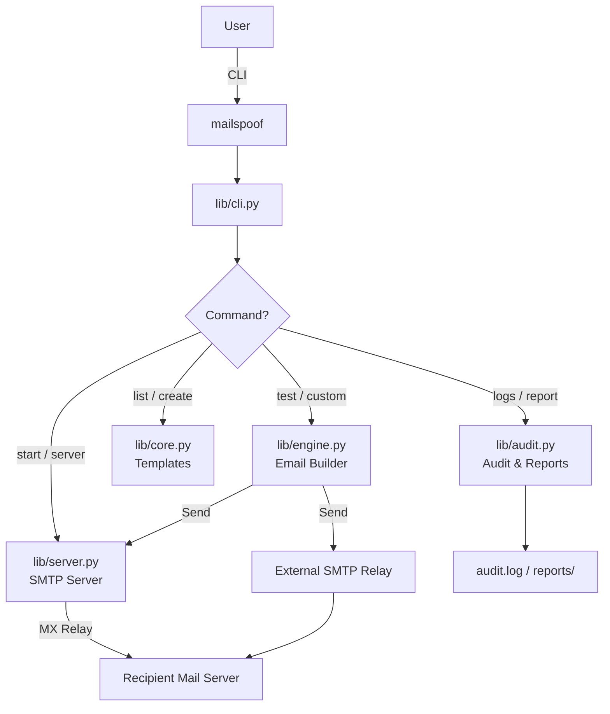
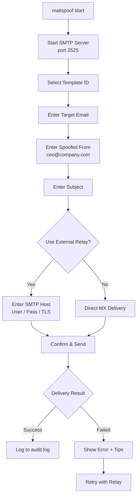
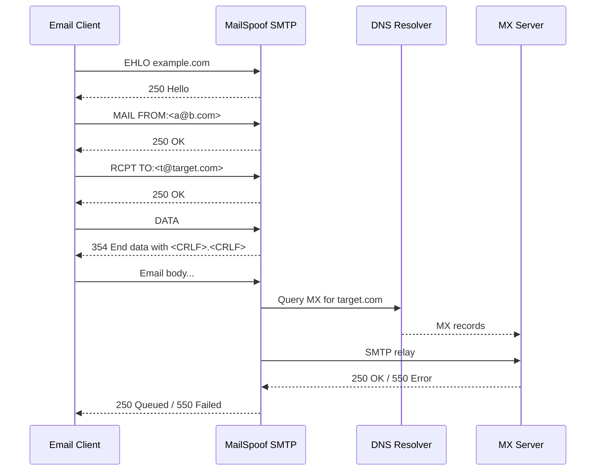

<div align="center">
<h2> ⚠️ Disclaimer</h2>
the tool hass issues installing MailSpoof pkgs I am working on it it will be resolve in 2 days on 8-jun-2026
</div>

<p align="center">
  
</p>

<div align="center">

# MailSpoof — Email Spoofing & Phishing Simulation Tool

[](LICENSE)
[](https://www.python.org/downloads/)
[](.github/workflows/ci.yml)
[](https://github.com/syed-sameer-ul-hassan/MailSpoof/releases)
[](https://github.com/syed-sameer-ul-hassan/MailSpoof/releases)
[]()
[]()
[](SECURITY.md)

</div>

---


**MailSpoof** is a professional, open-source email spoofing and phishing simulation framework for authorized penetration testing, red team exercises, and security awareness training. Built in Python with a built-in SMTP testing server, pre-built attack scenarios, custom template creation, audit logging, and report generation.

---

## Table of Contents

- [Features](#features)
- [Quick Start](#quick-start)
- [Installation](#installation)
- [Usage](#usage)
- [Email Spoofing Scenarios](#email-spoofing-scenarios)
- [Custom Templates](#custom-templates)
- [SMTP Relay & Delivery](#smtp-relay--delivery)
- [Audit Logs & Reports](#audit-logs--reports)
- [Project Structure](#project-structure)
- [Troubleshooting](#troubleshooting)
- [License](#license)
- [Legal Notice](#legal-notice)

---

## Features

- **Built-in SMTP Server** — Multi-threaded raw-socket SMTP server with optional MX relay for local testing
- **Phishing Simulation Scenarios** — 5 pre-built email spoofing templates (CEO fraud, IT support, HR, Microsoft, PayPal)
- **Custom Template Engine** — Create and save your own phishing email templates interactively
- **External SMTP Relay** — Send via Gmail, Outlook, SendGrid, or any authenticated SMTP server with TLS/SSL support
- **Audit Logging** — Every test is logged with timestamps, success/failure, and server details
- **JSON Reports** — Generate assessment reports with success rates and security recommendations
- **Cross-Platform** — Works on Linux, macOS, and Termux (Android)
- **Debian Package** — Install system-wide via `.deb`
- **Apache-2.0 Licensed** — Free for commercial and personal use

### Architecture Overview



---

## Quick Start

```bash
git clone https://github.com/syed-sameer-ul-hassan/MailSpoof.git
cd MailSpoof
pip install -r requirements.txt
chmod +x mailspoof
./mailspoof --version
```

Or install via Debian package:

```bash
sudo dpkg -i mailspoof-v1.0.0.deb
mailspoof --version
```

---

## Installation

### Option 1: Universal Installer (Any Distro)

Auto-detects your platform and installs dependencies:

```bash
bash install.sh
```

Supported: **Debian/Ubuntu**, **Fedora/RHEL/CentOS**, **Arch/Manjaro**, **macOS**, **Termux**, and others.

### Option 2: Debian / Ubuntu (.deb)

```bash
sudo dpkg -i mailspoof-v1.0.0.deb
sudo apt-get install -f
```

Or build from source:

```bash
bash scripts/build-deb.sh
```

### Option 3: Fedora / RHEL / CentOS (.rpm)

```bash
sudo dnf install rpm-build
rpmbuild -ba mailspoof.spec
sudo rpm -i ~/rpmbuild/RPMS/noarch/mailspoof-*.rpm
```

### Option 4: Arch Linux (AUR / PKGBUILD)

```bash
makepkg -si
```

Or install manually:

```bash
cd /tmp
git clone https://aur.archlinux.org/mailspoof.git
cd mailspoof
makepkg -si
```

### Option 5: Generic Makefile

```bash
make install
sudo make install PREFIX=/usr
```

### Option 6: Manual / Development

```bash
python3 -m venv venv
source venv/bin/activate
pip install -r requirements.txt
./mailspoof list
```

**Requirements:** Python 3.8+, `python3-venv` (or `python3-virtualenv` on RPM distros)

---

## Usage

### Interactive Session Workflow



### Interactive Email Spoofing Session

Launch the built-in SMTP server and send a spoofed email interactively:

```bash
mailspoof start --port 2525
```

You will be prompted for:
- Target email address
- Spoofed sender email & display name
- Subject line
- External SMTP relay settings (optional, recommended)
- Template ID

### Run a Built-in Phishing Scenario

```bash
mailspoof test 1 victim@company.com
```

### Start SMTP Server Only

```bash
mailspoof server --host 0.0.0.0 --port 2525
```

### List All Scenarios

```bash
mailspoof list
```

### Create Custom Phishing Template

```bash
mailspoof create
```

### Fully Custom Email Test

```bash
mailspoof custom \
  --from-email "ceo@company.com" \
  --from-name "CEO" \
  --subject "Urgent: Wire Transfer Required" \
  --body "Please review the attached invoice." \
  --target "finance@company.com" \
  --smtp-host smtp.gmail.com \
  --smtp-port 587 \
  --smtp-user your.email@gmail.com \
  --smtp-pass YOUR_APP_PASSWORD \
  --use-tls
```

### View Audit Logs

```bash
mailspoof logs --lines 50
```

### Generate Security Assessment Report

```bash
mailspoof report --output ./report.json
```

---

## Email Spoofing Scenarios

MailSpoof includes professionally crafted phishing simulation templates:

| ID | Scenario | Category | Severity |
|----|----------|----------|----------|
| 1 | CEO Fraud — Wire Transfer | Business Email Compromise | Critical |
| 2 | IT Support — Password Reset | Credential Harvesting | High |
| 3 | HR — Document Request | Data Exfiltration | Medium |
| 4 | Microsoft License Expired | Brand Impersonation | High |
| 5 | PayPal Security Alert | Financial Phishing | Critical |

See [docs/SECURITY_SCENARIOS.md](docs/SECURITY_SCENARIOS.md) for full details.

---

## Custom Templates

Create your own email spoofing scenarios by dropping `.txt` files into:

```
~/.mailspoof/templates/
```

### Simple Body-Only Template

```text
Dear user,

Your account has been compromised. Click the link below to reset.

https://evil.com/reset
```

### Full Template with Metadata

```text
Name: Custom Phishing Test
Category: Social Engineering
Severity: High
From Email: security@company.com
From Name: Security Team
Subject: Immediate Action Required
Body:
This is the email body.
It can span multiple lines.
Description: Tests employee awareness of suspicious links.
```

---

## SMTP Relay & Delivery

Direct MX delivery from residential IPs is blocked by Gmail, Yahoo, and Outlook. MailSpoof detects this and recommends using an external SMTP relay.

**Recommended relays:**
- **Gmail** — `smtp.gmail.com:587` (use App Passwords)
- **Outlook** — `smtp.office365.com:587`
- **SendGrid** — `smtp.sendgrid.net:587`
- **Custom** — Any authenticated SMTP server

See [docs/TROUBLESHOOTING.md](docs/TROUBLESHOOTING.md) for delivery error fixes.

---

## Audit Logs & Reports

All email spoofing tests are automatically logged:

- **Log file:** `~/.mailspoof/audit.log`
- **Reports:** `~/.mailspoof/reports/report_YYYYMMDD_HHMMSS.json`

Reports include:
- Total tests, success/failure counts
- Success rate percentage
- Risk assessment (CRITICAL / HIGH / MEDIUM)
- SPF/DKIM/DMARC bypass recommendations

---

## Project Structure

```
MailSpoof/
├── lib/
│   ├── banner.py       # Shared logo / banner helpers
│   ├── core.py         # Configuration, data classes, scenarios
│   ├── server.py       # Multi-threaded SMTP server with MX relay
│   ├── engine.py       # Email crafting, delivery, error handling
│   ├── audit.py        # Log viewer and report generator
│   └── cli.py          # Command-line interface
├── templates/builtins/   # Pre-built phishing scenarios
├── docs/               # Security scenarios, deployment, troubleshooting
├── scripts/            # Build scripts and wrappers
├── .github/
│   ├── ISSUE_TEMPLATE/
│   │   ├── bug_report.md
│   │   ├── feature_request.md
│   │   └── seo_optimization.md
│   ├── dependabot.yml          # Dependency updates
│   └── FUNDING.yml             # Sponsorship links
├── mailspoof           # Entry-point executable
├── install.sh          # Universal cross-platform installer
├── uninstall.py        # Python uninstaller
├── PKGBUILD            # Arch Linux package build
├── mailspoof.spec      # Fedora/RHEL RPM spec
├── Makefile            # Generic build & install
├── setup.py            # PyPI setuptools config
├── pyproject.toml      # Modern Python packaging
├── requirements.txt
├── LICENSE             # Apache-2.0
└── README.md
```

---

## Troubleshooting

Common issues and fixes are documented in [docs/TROUBLESHOOTING.md](docs/TROUBLESHOOTING.md), including:

- IP blacklist errors (TSS09, 550, 553)
- Port 25 connection failures
- SMTP authentication issues
- Gmail App Password setup
- Debian package installation

---

## Advanced Configuration

### Environment Variables

| Variable | Description | Default |
|----------|-------------|---------|
| `MAILSPOOF_CONFIG_DIR` | Config directory path | `~/.mailspoof` |
| `MAILSPOOF_LOG_LEVEL` | Logging level (DEBUG, INFO, WARNING) | INFO |
| `MAILSPOOF_SMTP_HOST` | Default SMTP relay host | localhost |
| `MAILSPOOF_SMTP_PORT` | Default SMTP relay port | 2525 |

### Custom Config File

Edit `~/.mailspoof/config.json` to set defaults:

```json
{
  "default_smtp_host": "smtp.gmail.com",
  "default_smtp_port": 587,
  "default_use_tls": true,
  "log_level": "INFO",
  "max_retries": 3,
  "timeout": 30
}
```

## Template Format Specification

MailSpoof templates are plain text files with a simple key-value format.

### Full Template Syntax

```text
Name: Template Name
Category: Attack Category
Severity: Low | Medium | High | Critical
From Email: spoofed@sender.com
From Name: Spoofed Display Name
Subject: Email Subject Line
Body:
This is the email body.
It supports multiple lines.
HTML tags are NOT supported.
Description: Brief description of what this scenario tests.
```

### Body-Only Template Syntax

For simple templates, only the body text is needed:

```text
Hello {{target_name}},

Your account requires verification.
Please click: https://example.com/verify

Regards,
Security Team
```

Placeholders like `{{target_name}}` are NOT processed by MailSpoof. They are included literally in the email body. Use custom templates for per-target personalization.

### Template Storage Locations

```
~/.mailspoof/templates/           # User custom templates
/usr/share/mailspoof/templates/builtins/  # Built-in templates
```

## Email Header Anatomy

When MailSpoof sends an email, these headers are crafted:

```
From: Spoofed Name <spoofed@example.com>
To: Target User <target@company.com>
Subject: Urgent Action Required
Date: Mon, 04 Jun 2026 12:00:00 +0000
Message-ID: <unique-id@mailspoof.local>
MIME-Version: 1.0
Content-Type: text/plain; charset="utf-8"
Content-Transfer-Encoding: 7bit
```

### Header Injection Prevention

MailSpoof automatically sanitizes input to prevent header injection attacks:

- Newlines in `From`, `To`, `Subject` are stripped
- Control characters are removed
- Maximum subject length: 998 characters (RFC 5322)

## SMTP Server Internals

The built-in SMTP server (`lib/server.py`) implements a minimal RFC 5321-compliant server:

### Supported Commands

| Command | Description |
|---------|-------------|
| `HELO` / `EHLO` | Client greeting |
| `MAIL FROM` | Sender address |
| `RCPT TO` | Recipient address |
| `DATA` | Email body |
| `RSET` | Reset transaction |
| `QUIT` | Close connection |

### MX Relay Process



### Port Binding

```bash
mailspoof server --host 0.0.0.0 --port 2525
```

- **Port 2525**: No root required, recommended for testing
- **Port 25**: Requires root, used for direct MX relay
- **Port 587**: Used for STARTTLS external relay submission

## Security Considerations

### Responsible Use

1. **Always obtain written authorization** before testing
2. **Document scope** in a formal engagement letter
3. **Set time limits** for the assessment window
4. **Notify stakeholders** before and after testing
5. **Preserve evidence** with audit logs

### IP Reputation

Direct MX delivery from residential IPs is heavily filtered:

| Provider | Filter Type | Success Rate |
|----------|-------------|--------------|
| Gmail | IP reputation + SPF/DKIM/DMARC | Very Low |
| Yahoo | IP blacklist (TSS09) | Very Low |
| Outlook | IP reputation + sender score | Very Low |
| Custom | Depends on configuration | Variable |

### Using External Relays

External SMTP relays bypass IP reputation checks because they use established mail server infrastructure.

## Rate Limiting & Ethics

### Built-in Rate Limits

MailSpoof does not enforce rate limits. As the operator, you must implement them:

```bash
# Example: limit to 10 emails per minute
for i in {1..10}; do
    mailspoof test 1 "target$i@example.com" --smtp-host smtp.gmail.com
    sleep 6
done
```

### Ethical Guidelines

- Do not send to random addresses
- Do not use for spam or harassment
- Do not spoof government or law enforcement domains
- Respect opt-out requests immediately
- Keep logs confidential and encrypted

## Windows / WSL Setup

### Windows Subsystem for Linux (WSL2)

```powershell
# In PowerShell (Admin)
wsl --install -d Ubuntu
# Restart, then open Ubuntu terminal
cd ~
git clone https://github.com/syed-sameer-ul-hassan/MailSpoof.git
cd MailSpoof
bash install.sh
```

### Native Windows (Not Recommended)

MailSpoof is designed for Unix-like systems. For native Windows:

1. Install Python 3.8+ from python.org
2. Install Git for Windows
3. Use Git Bash or PowerShell
4. Run `python mailspoof` instead of `./mailspoof`

## Docker Installation (Conceptual)

```dockerfile
FROM python:3.11-slim
WORKDIR /app
COPY . .
RUN pip install -r requirements.txt
EXPOSE 2525
ENTRYPOINT ["python", "mailspoof"]
```

```bash
docker build -t mailspoof .
docker run -it --rm -p 2525:2525 mailspoof server --port 2525
```

## Cloud Deployment

### AWS EC2

```bash
# Launch Ubuntu 22.04 instance
sudo apt update && sudo apt install -y python3 python3-venv git
git clone https://github.com/syed-sameer-ul-hassan/MailSpoof.git
cd MailSpoof
bash install.sh
# Open port 2525 in Security Group
```

### Google Cloud Platform

```bash
# Create VM with allowed SMTP egress
gcloud compute instances create mailspoof-test \
    --image-family=ubuntu-2204-lts \
    --image-project=ubuntu-os-cloud
# SSH and install as above
```

### Azure VM

```bash
# Standard Ubuntu VM
# Allow outbound port 587 in NSG
bash install.sh
```

## CI/CD Integration

### GitHub Actions Example

```yaml
jobs:
  email-test:
    runs-on: ubuntu-latest
    steps:
      - uses: actions/checkout@v4
      - run: pip install -r requirements.txt
      - run: ./mailspoof test 1 test@example.com --smtp-host ${{ secrets.SMTP_HOST }}
```

### GitLab CI Example

```yaml
test_email:
  image: python:3.11
  script:
    - pip install -r requirements.txt
    - ./mailspoof test 1 $TEST_EMAIL --smtp-host $SMTP_HOST
```

## Programmatic API Usage

While MailSpoof is primarily a CLI tool, you can use its functions directly:

```python
from lib.core import Config, Scenario
from lib.engine import send_email, run_scenario

config = Config()

scenario = Scenario(
    id=1,
    name="CEO Fraud",
    category="BEC",
    severity="Critical",
    from_email="ceo@company.com",
    from_name="CEO",
    subject="Urgent: Wire Transfer",
    body="Please process the attached transfer.",
    description="CEO fraud simulation",
    source="custom",
)

ok = run_scenario(
    scenario, "target@company.com",
    "smtp.gmail.com", 587, config,
    smtp_user="user@gmail.com",
    smtp_pass="app_password",
    use_tls=True,
)
print("Sent!" if ok else "Failed")
```

## Custom Plugin Development

MailSpoof does not have a formal plugin API, but you can extend it by:

1. Adding template files to `templates/builtins/`
2. Modifying `lib/core.py` to register new scenarios
3. Extending `lib/engine.py` for custom delivery logic

### Adding a New Scenario Programmatically

```python
from lib.core import Scenario

my_scenario = Scenario(
    id=99,
    name="Custom Test",
    category="Social Engineering",
    severity="Medium",
    from_email="support@fake-service.com",
    from_name="Support Team",
    subject="Account Verification Required",
    body="Please verify your account at https://fake-link.com",
    description="Custom awareness test",
    source="custom",
)
```

## Performance Tuning

### Concurrent Testing

MailSpoof's SMTP server handles concurrent connections via threading:

```bash
# Default: 1 connection per client
# Server supports multiple simultaneous clients
mailspoof server --port 2525
```

### Memory Usage

| Component | Memory |
|-----------|--------|
| CLI startup | ~20 MB |
| SMTP server | ~30 MB |
| Per email | ~5 MB |
| Full audit log | Grows with entries |

### Disk Usage

```bash
# Check log size
ls -lh ~/.mailspoof/audit.log
# Rotate logs
mv ~/.mailspoof/audit.log ~/.mailspoof/audit.log.$(date +%Y%m%d)
```

## Logging Configuration

### Default Log Format

```json
{"timestamp": "2026-06-04T12:00:00", "scenario_id": 1, "target": "user@company.com", "success": true, "server": "smtp.gmail.com:587"}
```

### Log Rotation

MailSpoof does not auto-rotate logs. Use `logrotate`:

```bash
# /etc/logrotate.d/mailspoof
/home/*/.mailspoof/audit.log {
    daily
    rotate 7
    compress
    delaycompress
    missingok
    notifempty
}
```

## Report Schema

### JSON Report Structure

```json
{
  "generated_at": "2026-06-04T12:00:00",
  "total_tests": 10,
  "successful": 7,
  "failed": 3,
  "success_rate": 70.0,
  "risk_level": "HIGH",
  "recommendations": [
    "Implement SPF record",
    "Enable DMARC enforcement",
    "Train employees on phishing"
  ],
  "entries": [
    {
      "timestamp": "2026-06-04T11:00:00",
      "scenario": "CEO Fraud",
      "target": "finance@company.com",
      "success": true
    }
  ]
}
```

## Comparison with Other Tools

| Feature | MailSpoof | Gophish | Social-Engineer Toolkit |
|---------|-----------|---------|------------------------|
| Built-in SMTP | Yes | Yes | No |
| Custom templates | Yes | Yes | Yes |
| Web dashboard | No | Yes | No |
| Open source | Yes | Yes | Yes |
| CLI-first | Yes | No | Yes |
| Debian package | Yes | No | No |
| Cross-platform | Yes | Yes | Linux only |
| Lightweight | Yes | Medium | Heavy |

MailSpoof is designed for users who prefer a lightweight, scriptable CLI tool without the overhead of a web dashboard.

## FAQ

### Q: Can I send to Gmail?

Yes, but use an external SMTP relay. Direct MX delivery to Gmail will fail from residential IPs.

### Q: Is this illegal?

MailSpoof is legal when used for authorized security testing. Unauthorized use violates computer fraud laws in most jurisdictions.

### Q: Does it support HTML emails?

Currently, MailSpoof sends plain text only. HTML support may be added in future versions.

### Q: Can I schedule campaigns?

Use `cron` for scheduled testing:

```bash
crontab -e
# Run test every Monday at 9 AM
0 9 * * 1 /usr/bin/mailspoof test 1 target@company.com --smtp-host smtp.gmail.com --smtp-port 587
```

### Q: How do I update?

```bash
cd MailSpoof
git pull
bash install.sh
```

Or via `.deb`:

```bash
sudo dpkg -i mailspoof-v1.0.0.deb
```

### Q: Where are templates stored?

Built-in: `/usr/share/mailspoof/templates/builtins/` (system) or project directory (manual)
Custom: `~/.mailspoof/templates/`

### Q: Can I use it on a VPS?

Yes. Most cloud providers block port 25 by default. Request port 25 unblocking or use external SMTP relay on port 587.

### Q: What Python version?

Python 3.8 or newer. Tested on 3.8, 3.9, 3.10, 3.11, 3.12, 3.13.

### Q: Does it work offline?

The SMTP server works offline. Email delivery requires internet connectivity.

### Q: Can I chain commands?

Yes, use shell scripting:

```bash
mailspoof test 1 user1@company.com && \
mailspoof test 2 user2@company.com && \
mailspoof report --output report.json
```

## Glossary

| Term | Definition |
|------|------------|
| **BEC** | Business Email Compromise |
| **DMARC** | Domain-based Message Authentication, Reporting, and Conformance |
| **DKIM** | DomainKeys Identified Mail |
| **MX** | Mail Exchange (DNS record for mail servers) |
| **PHI** | Protected Health Information |
| **PII** | Personally Identifiable Information |
| **RBL** | Real-time Blackhole List |
| **SPF** | Sender Policy Framework |
| **STARTTLS** | Upgrade plain text connection to TLS |
| **TSS09** | Yahoo-specific IP blacklist error code |

## Advanced SMTP Relay Setup

### Gmail / Google Workspace

```bash
mailspoof test 1 target@gmail.com \
    --smtp-host smtp.gmail.com \
    --smtp-port 587 \
    --smtp-user your.email@gmail.com \
    --smtp-pass "xxxx xxxx xxxx xxxx" \
    --use-tls
```

Generate App Password at: https://myaccount.google.com/apppasswords

### Microsoft 365 / Outlook

```bash
mailspoof test 1 target@outlook.com \
    --smtp-host smtp.office365.com \
    --smtp-port 587 \
    --smtp-user your.email@company.com \
    --smtp-pass YOUR_PASSWORD \
    --use-tls
```

### SendGrid

```bash
mailspoof test 1 target@company.com \
    --smtp-host smtp.sendgrid.net \
    --smtp-port 587 \
    --smtp-user apikey \
    --smtp-pass YOUR_SENDGRID_API_KEY \
    --use-tls
```

### Amazon SES

```bash
mailspoof test 1 target@company.com \
    --smtp-host email-smtp.us-east-1.amazonaws.com \
    --smtp-port 587 \
    --smtp-user YOUR_SES_USERNAME \
    --smtp-pass YOUR_SES_PASSWORD \
    --use-tls
```

### Custom SMTP Server

```bash
mailspoof test 1 target@company.com \
    --smtp-host mail.yourserver.com \
    --smtp-port 25 \
    --smtp-user admin \
    --smtp-pass password
```

## Development Setup

### Running Tests

```bash
python3 -m py_compile lib/*.py mailspoof uninstall.py
bash -n install.sh
```

### Linting

```bash
pip install ruff
ruff check . --ignore E501
```

### Type Checking

```bash
pip install pyright
pyright lib/ mailspoof uninstall.py
```

### Building Packages

```bash
# Debian
bash scripts/build-deb.sh

# RPM
rpmbuild -ba mailspoof.spec

# Arch
makepkg -si
```

## Debug Mode

Enable verbose logging:

```bash
MAILSPOOF_LOG_LEVEL=DEBUG ./mailspoof start --port 2525
```

Or modify `lib/core.py`:

```python
logging.basicConfig(level=logging.DEBUG)
```

## Network Requirements

### Inbound Ports

| Port | Protocol | Description |
|------|----------|-------------|
| 2525 | TCP | Built-in SMTP server |
| 25 | TCP | Direct MX relay (root required) |

### Outbound Ports

| Port | Protocol | Description |
|------|----------|-------------|
| 25 | TCP | Direct MX relay |
| 587 | TCP | STARTTLS submission |
| 465 | TCP | SSL submission |
| 53 | UDP | DNS MX lookups |

### Firewall Rules

```bash
# Allow built-in SMTP server
sudo ufw allow 2525/tcp

# Allow outbound SMTP (usually allowed by default)
sudo ufw allow out 587/tcp
sudo ufw allow out 25/tcp
```

## ASCII Screenshot Examples

### mailspoof list

```text
 MailSpoof Professional Email Security Assessment v1.0.0

--- Available Templates ---

  [1] CEO Fraud - Wire Transfer        [Critical]
  [2] IT Support - Password Reset      [High]
  [3] HR - Document Request            [Medium]
  [4] Microsoft License Expired        [High]
  [5] PayPal Security Alert          [Critical]

  [+] Custom templates: 3 found in ~/.mailspoof/templates/
```

### mailspoof start

```text
 MailSpoof SMTP Server v1.0.0

  Listening on 0.0.0.0:2525
  Logs: /home/user/.mailspoof/audit.log

  Press Ctrl+C to stop.

--- Interactive Spoofing Session ---

Target email: victim@company.com
Spoof from email: ceo@company.com
Sender display name: CEO
Subject: Urgent: Wire Transfer Required

--- SMTP Relay Settings ---

Use external SMTP relay? [y/N]: y
SMTP host: smtp.gmail.com
SMTP port [587]: 587
SMTP username: your.email@gmail.com
SMTP password: *******
Use TLS/SSL? [Y/n]:
```

### mailspoof report

```text
--- Assessment Report ---

  Total Tests:     10
  Successful:      7
  Failed:          3
  Success Rate:    70.0%
  Risk Level:      HIGH

  Recommendations:
    - Implement SPF record for company.com
    - Enable DMARC enforcement (p=quarantine)
    - Conduct employee phishing awareness training

  Report saved: /home/user/.mailspoof/reports/report_20260604_120000.json
```

## Version History

See [docs/CHANGELOG.md](docs/CHANGELOG.md) for full release notes.

## Support

- Issues: [GitHub Issues](https://github.com/syed-sameer-ul-hassan/MailSpoof/issues)
- Security: See [SECURITY.md](SECURITY.md)
- Discussions: [GitHub Discussions](https://github.com/syed-sameer-ul-hassan/MailSpoof/discussions)


## License

Licensed under the **Apache License 2.0**. See [LICENSE](LICENSE) for full terms.

---

## Legal Notice

MailSpoof is intended for **authorized security testing, red team exercises, and educational purposes only**. Obtain explicit written permission before testing any systems you do not own.

**The author will not be responsible for any misuse of this tool.** Users are solely responsible for ensuring their use of MailSpoof complies with all applicable laws and regulations in their jurisdiction. The author assumes no liability for any damage, legal consequences, or harm resulting from unauthorized or illegal use of this software.

---

## Contributing

Contributions are welcome! See [CONTRIBUTING.md](CONTRIBUTING.md) for guidelines.

Report security vulnerabilities privately: see [SECURITY.md](SECURITY.md).
