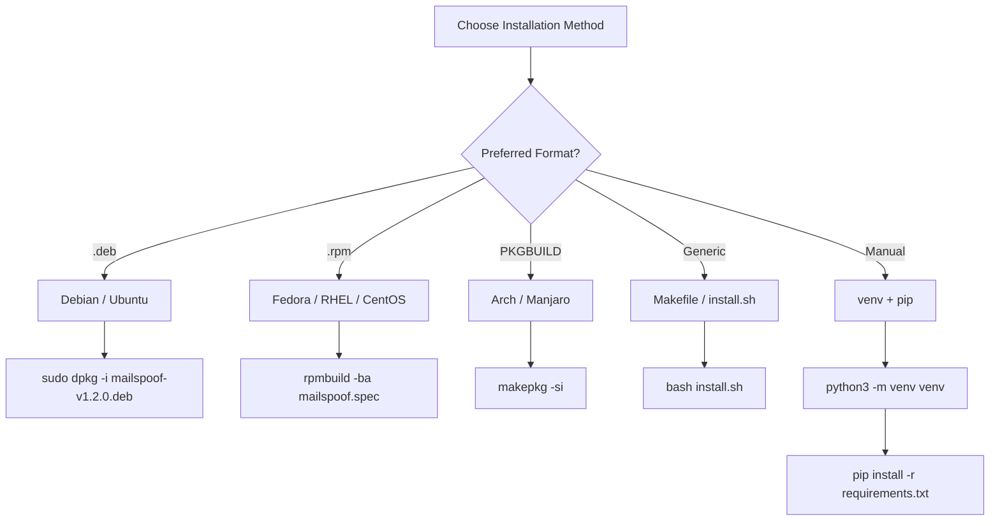

# MailSpoof — Deployment Guide

> Professional Email Spoofing and Phishing Simulation Framework
>
> Installation methods for Debian, Fedora, Arch, macOS, Termux, and generic Linux.

## Installation Decision Tree



## Method 1: Universal Installer (Any Distro)

Auto-detects your platform and installs the correct dependencies:

```bash
cd MailSpoof
bash install.sh
```

Supported: Debian, Ubuntu, Fedora, RHEL, CentOS, Rocky, AlmaLinux, Arch, Manjaro, EndeavourOS, macOS, Termux, and generic Python3 installs.

## Method 2: Debian / Ubuntu (.deb)

```bash
sudo dpkg -i mailspoof-v1.2.0.deb
sudo apt-get install -f
```

The `.deb` installs to `/usr/share/mailspoof/` and creates `/usr/bin/mailspoof`.

Or build from source:

```bash
bash scripts/build-deb.sh
```

## Method 3: Fedora / RHEL / CentOS / openSUSE (.rpm)

```bash
sudo dnf install rpm-build
rpmbuild -ba mailspoof.spec
sudo rpm -i ~/rpmbuild/RPMS/noarch/mailspoof-*.rpm
```

## Method 4: Arch Linux (AUR / PKGBUILD)

```bash
cd MailSpoof
makepkg -si
```

Or install from AUR helper:

```bash
yay -S mailspoof
```

## Method 5: Generic Makefile

```bash
make install
sudo make install PREFIX=/usr
make uninstall
```

## Method 6: Manual / Development

```bash
python3 -m venv venv
source venv/bin/activate
pip install -r requirements.txt
./mailspoof --version
```

## Requirements

| Distro | Packages |
|--------|----------|
| Debian/Ubuntu | `python3`, `python3-venv`, `python3-pip` |
| Fedora/RHEL | `python3`, `python3-pip`, `python3-virtualenv` |
| Arch | `python`, `python-pip`, `python-virtualenv` |

Optional: `dnspython` for MX record lookups.

## Port Requirements

| Port | Use | Privilege |
|------|-----|-----------|
| 25 | Direct MX relay | Root |
| 2525 | Built-in SMTP server | Any |
| 587 | External SMTP relay (STARTTLS) | Any |
| 465 | External SMTP relay (SSL) | Any |

## Post-Install: Desktop Launcher

The `install.sh` script automatically installs:
- `mailspoof.desktop` to the application menu
- `assets/icon.svg` as the application icon

If the icon does not appear immediately:

```bash
update-desktop-database ~/.local/share/applications  # user install
# or
sudo update-desktop-database /usr/share/applications   # system install
```

## Post-Install: SMTP Profiles

Set up saved relay profiles for faster testing:

```bash
mailspoof profile add gmail --host smtp.gmail.com --port 587 --user your.email@gmail.com --pass APP_PASSWORD --use-tls
mailspoof profile add outlook --host smtp.office365.com --port 587 --user your.email@outlook.com --pass PASSWORD --use-tls
```

Use profiles in any command:

```bash
mailspoof test 1 target@company.com --profile gmail --verbose
mailspoof start --profile gmail
mailspoof custom --from-email ... --target ... --profile outlook
```

## Post-Install: Custom Templates

Create persistent custom templates:

```bash
mailspoof create        # Interactive creation (auto-assigns ID)
mailspoof list          # Verify new template appears
mailspoof preview <id>  # Preview before using
```

Custom templates are stored in:

```
~/.mailspoof/templates/custom/
```

## Uninstall

```bash
mailspoof uninstall
```

Or manually:

```bash
sudo rm -f /usr/bin/mailspoof
sudo rm -rf /usr/share/mailspoof
rm -rf ~/.mailspoof
```
