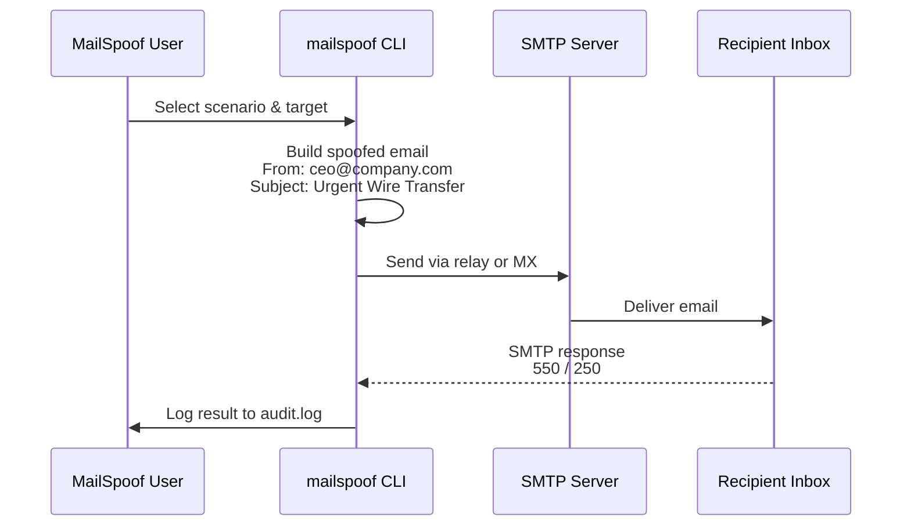

# MailSpoof — Security Scenarios Catalog

> Professional Email Spoofing and Phishing Simulation Framework
>
> Built-in email spoofing scenarios and attack flow documentation.

## Attack Flow Overview

## Scenario Matrix

| ID | Name | Category | Severity | Description |
|----|------|----------|----------|-------------|
| 1 | CEO Fraud - Wire Transfer | Business Email Compromise | Critical | Fake CEO request for urgent wire transfer |
| 2 | IT Support - Password Reset | Credential Harvesting | High | Fake IT support password reset link |
| 3 | HR - Document Request | Data Exfiltration | Medium | Fake HR request for sensitive documents |
| 4 | Microsoft License Expired | Brand Impersonation | High | Fake Microsoft license renewal notice |
| 5 | PayPal Security Alert | Financial Phishing | Critical | Fake PayPal security verification email |

## Severity Legend

- **Critical** — Immediate business/financial risk
- **High** — Significant credential or data exposure risk
- **Medium** — Moderate information disclosure
- **Low** — Minor awareness test

## Custom Templates

Drop `.txt` files into `~/.mailspoof/templates/` to add your own scenarios.
See [README.md](../README.md) for template format.
