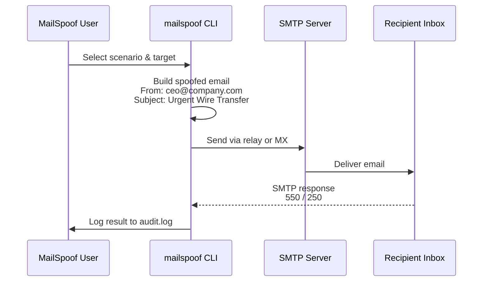

# MailSpoof — Security Scenarios Catalog

> Professional Email Spoofing and Phishing Simulation Framework
>
> Built-in email spoofing scenarios and attack flow documentation.

## Attack Flow Overview



## Built-in Scenario Matrix

### Business Email Compromise (BEC)

| ID | Name | Severity | Description |
|----|------|----------|-------------|
| 1 | Payment Authorization - CFO | Critical | Fake CFO request for urgent wire transfer |
| 7 | Overdue Invoice Reminder | High | Fake vendor invoice with payment link |

### Credential Harvesting

| ID | Name | Severity | Description |
|----|------|----------|-------------|
| 2 | IT Service Desk - Password Reset | High | Fake IT support password reset link |
| 8 | MFA Reset Request | Critical | Fake MFA reset prompt |

### Social Media Phishing

| ID | Name | Severity | Description |
|----|------|----------|-------------|
| 9 | LinkedIn Security Verification | High | Fake LinkedIn security alert |
| 10 | Facebook Policy Violation Review | High | Fake Facebook policy violation notice |
| 11 | Instagram Support Notice | Medium | Fake Instagram account support |
| 12 | Twitter/X Account Lock Notice | High | Fake Twitter account lock alert |
| 13 | TikTok Creator Monetization Notice | Medium | Fake TikTok monetization update |
| 28 | Snapchat Account Locked | Medium | Fake Snapchat account lock |
| 29 | Pinterest Security Check | Medium | Fake Pinterest login activity review |
| 30 | Reddit Moderator Action Required | Medium | Fake Reddit moderator policy notice |
| 31 | Discord Trust & Safety Notice | Medium | Fake Discord server compliance review |
| 38 | Meta Ads Payment Failure | High | Fake Facebook/Meta ads billing failure |
| 41 | LinkedIn Job Offer Confirmation | Medium | Fake LinkedIn recruiter job opportunity |
| 42 | Instagram Ads Policy Notice | High | Fake Instagram ads policy violation |
| 44 | Twitch Partner Eligibility Review | Medium | Fake Twitch partner eligibility notice |

### SaaS / Cloud Platform Phishing

| ID | Name | Severity | Description |
|----|------|----------|-------------|
| 4 | Microsoft 365 License Expiry Notice | Medium | Fake Microsoft license renewal |
| 14 | Slack Workspace Verification | High | Fake Slack workspace verification |
| 15 | Zoom Account Suspension Notice | High | Fake Zoom account suspension |
| 16 | Outlook Quarantine Release | High | Fake Outlook quarantine release |
| 21 | Google Workspace Sharing Review | Medium | Fake Google Drive sharing review |
| 22 | Dropbox File Access Expiring | Medium | Fake Dropbox file access expiry |
| 23 | Zoom Recording Share Notification | Medium | Fake Zoom recording shared notice |
| 37 | OneDrive Shared Folder Access | Medium | Fake OneDrive shared folder invitation |
| 40 | Microsoft Teams Guest Access | Medium | Fake Teams guest team invite |
| 43 | WhatsApp Backup Verification | Medium | Fake WhatsApp backup access notice |

### Developer Platform Phishing

| ID | Name | Severity | Description |
|----|------|----------|-------------|
| 17 | GitHub OAuth Re-Authentication | High | Fake GitHub OAuth re-auth request |
| 18 | Salesforce MFA Reset | High | Fake Salesforce MFA reset |
| 24 | GitLab OAuth Token Renewal | High | Fake GitLab OAuth token renewal |
| 25 | Bitbucket Access Review | Medium | Fake Bitbucket access review |
| 26 | GitHub SSO Re-Verification | High | Fake GitHub SSO re-verification |

### Financial Services Phishing

| ID | Name | Severity | Description |
|----|------|----------|-------------|
| 3 | Account Suspension Notice - Bank Security | Critical | Fake bank account suspension alert |
| 5 | PayPal Account Review | High | Fake PayPal security review |
| 36 | PayPal Invoice Reminder | Medium | Fake PayPal invoice payment request |

### Consumer Service Phishing

| ID | Name | Severity | Description |
|----|------|----------|-------------|
| 19 | Apple ID Locked Alert | High | Fake Apple ID locked notice |
| 20 | AWS Root Access Alert | Critical | Fake AWS root access alert |
| 32 | Spotify Payment Verification | Medium | Fake Spotify billing failure |
| 33 | Netflix Account Verification | Medium | Fake Netflix billing verification |
| 34 | Airbnb Payout Confirmation | Medium | Fake Airbnb payout confirmation |
| 35 | Uber Receipt Verification | Low | Fake Uber trip receipt verification |
| 39 | Amazon Order Verification | Medium | Fake Amazon order confirmation |
| 45 | Prime Video Payment Authorization | Medium | Fake Prime Video billing failure |

### HR / Employee Targeting

| ID | Name | Severity | Description |
|----|------|----------|-------------|
| 6 | HR Benefits Form Update | High | Fake HR benefits enrollment update |

## Severity Legend

- **Critical** — Immediate business/financial risk
- **High** — Significant credential or data exposure risk
- **Medium** — Moderate information disclosure
- **Low** — Minor awareness test

## Template Management

### Create Custom Template

```bash
mailspoof create
# or
mailspoof -t
```

Custom templates are auto-assigned the next available ID and saved to `~/.mailspoof/templates/custom/`.

### Preview Template

```bash
mailspoof preview <id>        # Strip HTML for text preview
mailspoof preview <id> --raw   # Show raw HTML
```

### Edit Template

```bash
mailspoof edit-template <id>   # Opens in $EDITOR (default nano)
```

Works for both built-in and custom templates. After editing, templates are auto-reloaded.

### Remove Template

```bash
mailspoof remove-template <id>
```

Only works for custom templates. Built-in templates are protected.

### List Templates

```bash
mailspoof list                              # List all templates
mailspoof list --filter linkedin            # Filter by name/tag/content
mailspoof list --filter "social media"      # Filter by category/content
```

## SMTP Profile Management

Save frequently-used SMTP relay credentials and reuse them:

```bash
# Add a profile
mailspoof profile add gmail --host smtp.gmail.com --port 587 --user your-email@gmail.com --pass app-password --use-tls

# List profiles
mailspoof profile list

# Remove a profile
mailspoof profile remove gmail

# Use a profile in any send command
mailspoof test 1 target@company.com --profile gmail --verbose
mailspoof custom --from-email ... --target ... --profile gmail
mailspoof start --profile gmail
```

## Report Formats

```bash
mailspoof report                          # Default JSON report
mailspoof report --format csv             # CSV report
mailspoof report --output my_report.csv --format csv
```

## Template File Format

```text
Id: 47
Name: My Custom Template
Category: Custom
Severity: Medium
From Email: noreply@company.com
From Name: Company Support
Subject: Action Required
Body:
<html>
  <body>
    <p>Your message here.</p>
    <a href="https://...">Action</a>
  </body>
</html>
Description: My custom phishing template.
Tags: custom, testing
```

- `Id` — Unique template ID (auto-assigned for custom templates)
- `Tags` — Optional comma-separated tags for filtering
- `{TODAY}` — Automatically replaced with current date (`YYYY-MM-DD`)

See [README.md](../README.md) for full usage documentation.
