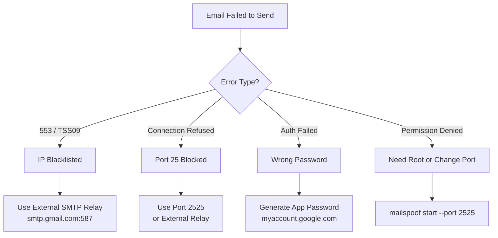

# MailSpoof — Troubleshooting Guide

> Professional Email Spoofing and Phishing Simulation Framework
>
> Common errors, fixes, and SMTP delivery troubleshooting steps.

## Error Decision Tree



## Email Delivery Failures

### `553 5.7.2 [TSS09] All messages permanently deferred`

**Cause:** Your IP is blacklisted by Yahoo/Gmail/Outlook.

**Fix:** Use an external SMTP relay:

```bash
mailspoof test 1 target@yahoo.com \
    --smtp-host smtp.gmail.com \
    --smtp-port 587 \
    --smtp-user your.email@gmail.com \
    --smtp-pass YOUR_APP_PASSWORD
```

### `Connection refused` on port 25

**Cause:** ISP blocks outbound port 25.

**Fix:** Use port 587 with an external relay, or host the server on port 2525.

## SMTP Server Issues

### `Permission denied on port 25`

**Fix:** Run with `sudo` or use `--port 2525`.

### `Address already in use`

**Fix:** Kill the existing process:

```bash
lsof -i :2525
kill <PID>
```

## Authentication

### `SMTP Authentication failed`

**Fix:** For Gmail, generate an **App Password** at myaccount.google.com/apppasswords.
Do not use your regular Gmail password.

### Profile not found

**Fix:** Check saved profiles:

```bash
mailspoof profile list
```

Add a profile if missing:

```bash
mailspoof profile add gmail --host smtp.gmail.com --port 587 --user your.email@gmail.com --pass APP_PASSWORD --use-tls
```

## Template Management

### `Template file not found on disk`

**Cause:** The template file was deleted or renamed externally.

**Fix:** Run `mailspoof list` to see current IDs. For custom templates, the file must exist in `~/.mailspoof/templates/custom/`.

### `Cannot remove built-in templates`

Built-in templates are protected. Only custom templates created with `mailspoof create` can be removed.

## Diagnostics

### Need more details about a send failure

**Fix:** Use `--verbose` to see each SMTP stage:

```bash
mailspoof test 1 target@company.com --profile gmail --verbose
```

Output shows: connect, TLS, login, and send stages with specific errors.

## Desktop Launcher

### Application menu entry not showing

**Fix:** After `install.sh`, the `.desktop` file is placed in standard locations:
- User install: `~/.local/share/applications/mailspoof.desktop`
- System install: `/usr/share/applications/mailspoof.desktop`

Refresh the desktop database:

```bash
update-desktop-database ~/.local/share/applications  # user install
# or
sudo update-desktop-database /usr/share/applications   # system install
```

## Logs & Reports

### Where are logs stored?

```
~/.mailspoof/audit.log
```

### Where are reports saved?

```
~/.mailspoof/reports/
```

### Report format not recognized

**Fix:** Use `--format` with `json` (default) or `csv`:

```bash
mailspoof report --format csv
mailspoof report --output my_report.csv --format csv
```

## Debian Package

### `mailspoof command not found` after `.deb` install

**Fix:** Ensure `/usr/bin/mailspoof` exists. If not, reinstall:

```bash
sudo dpkg -r mailspoof
sudo dpkg -i mailspoof-v1.2.0.deb
```
