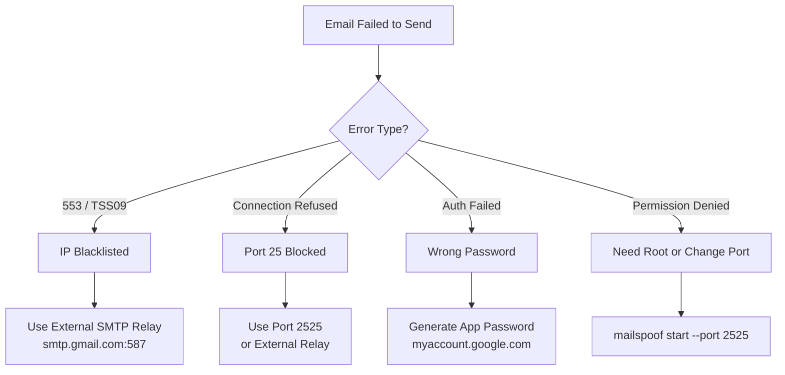

# MailSpoof — Troubleshooting Guide

> Professional Email Spoofing and Phishing Simulation Framework
>
> Common errors, fixes, and SMTP delivery troubleshooting steps.

## Error Decision Tree



## Email Delivery Failures

### `553 5.7.2 [TSS09] All messages permanently deferred`

**Cause:** Your IP is blacklisted by Yahoo/Gmail/Outlook.

**Fix:** Use an external SMTP relay:

```bash
mailspoof test 1 target@yahoo.com \
    --smtp-host smtp.gmail.com \
    --smtp-port 587 \
    --smtp-user your.email@gmail.com \
    --smtp-pass YOUR_APP_PASSWORD
```

### `Connection refused` on port 25

**Cause:** ISP blocks outbound port 25.

**Fix:** Use port 587 with an external relay, or host the server on port 2525.

## SMTP Server Issues

### `Permission denied on port 25`

**Fix:** Run with `sudo` or use `--port 2525`.

### `Address already in use`

**Fix:** Kill the existing process:

```bash
lsof -i :2525
kill <PID>
```

## Authentication

### `SMTP Authentication failed`

**Fix:** For Gmail, generate an **App Password** at myaccount.google.com/apppasswords.
Do not use your regular Gmail password.

## Logs & Reports

### Where are logs stored?

```
~/.mailspoof/audit.log
```

### Where are reports saved?

```
~/.mailspoof/reports/
```

## Debian Package

### `mailspoof command not found` after `.deb` install

**Fix:** Ensure `/usr/bin/mailspoof` exists. If not, reinstall:

```bash
sudo dpkg -r mailspoof
sudo dpkg -i mailspoof-v1.0.0.deb
```
