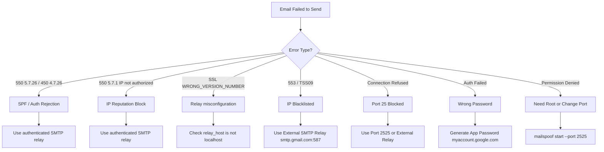

# MailSpoof — Troubleshooting Guide

> Professional Email Spoofing and Phishing Simulation Framework
>
> Common errors, fixes, and SMTP delivery troubleshooting steps.

## Error Decision Tree


```mermaid
flowchart TD
    A[Email Failed to Send] --> B{Error Type?}
    B -->|550 5.7.26 / 450 4.7.26| C[SPF / Auth Rejection]
    B -->|550 5.7.1 IP not authorized| D[IP Reputation Block]
    B -->|SSL WRONG_VERSION_NUMBER| E[Relay misconfiguration]
    B -->|553 / TSS09| F[IP Blacklisted]
    B -->|Connection Refused| G[Port 25 Blocked]
    B -->|Auth Failed| H[Wrong Password]
    B -->|Permission Denied| I[Need Root or Change Port]
    C --> C1[Use authenticated SMTP relay]
    D --> D1[Use authenticated SMTP relay]
    E --> E1[Check relay_host is not localhost]
    F --> F1[Use External SMTP Relay smtp.gmail.com:587]
    G --> G1[Use Port 2525 or External Relay]
    H --> H1[Generate App Password myaccount.google.com]
    I --> I1[mailspoof start --port 2525]
```

---

## Email Delivery Failures

### `550 5.7.26 Cannot forward emails that are not authenticated`

**Cause:** The recipient domain uses Cloudflare Email Routing (or similar strict SPF enforcement). Cloudflare rejects all connections from IPs that are not listed in the sender domain's SPF record. This applies regardless of the sender address you spoof.

**What is happening:** MailSpoof connects to the recipient's MX server (Cloudflare, Google, etc.) and presents a spoofed `From` address. The receiving server checks DNS to see if your IP is authorized to send from that domain. It is not, so the connection is rejected. This is SPF working as designed.

**Fix:** Route mail through an authenticated SMTP relay. The relay is trusted by the recipient's server. The spoofed From address still appears to the recipient.

```bash
# Save once
mailspoof profile add default \
  --host smtp.gmail.com \
  --port 587 \
  --user your.email@gmail.com \
  --pass "xxxx xxxx xxxx xxxx" \
  --use-tls

# Run normally after that
mailspoof start
```

Generate a Gmail App Password at: https://myaccount.google.com/apppasswords

---

### `550 5.7.1 The IP you're using to send mail is not authorized`

**Cause:** Google (and most major providers) explicitly block direct SMTP connections from residential and cloud IPs. The error message itself instructs you to use a relay.

**Fix:** Same as above. Use `smtp.gmail.com:587` as the relay.

---

### `553 5.7.2 [TSS09] All messages permanently deferred`

**Cause:** Your IP is on Yahoo's real-time blackhole list.

**Fix:**

```bash
mailspoof test 1 target@yahoo.com \
    --smtp-host smtp.gmail.com \
    --smtp-port 587 \
    --smtp-user your.email@gmail.com \
    --smtp-pass YOUR_APP_PASSWORD \
    --use-tls
```

---

### `554 Refused. You have no reverse DNS entry`

**Cause:** The recipient mail server requires a PTR (reverse DNS) record for the connecting IP. Residential and most cloud IPs do not have PTR records matching the sending domain.

**Fix:** Use an authenticated SMTP relay. The relay's IP has a valid PTR record.

---

### `Connection refused` on port 25

**Cause:** Most ISPs and cloud providers block outbound port 25 to prevent spam.

**Fix:** Use port 587 with an external relay, or run the built-in server on port 2525:

```bash
mailspoof start --port 2525
```

---

### `SSL: WRONG_VERSION_NUMBER`

**Cause:** The server attempted to initiate an SSL handshake with a server that does not speak SSL on that port. This typically happened because `relay_host` was set to `localhost` or `127.0.0.1` by default, causing the embedded SMTP server to try relaying to itself with TLS enabled.

**Fix (v1.2.1+):** This bug is fixed. The server now starts with no relay and only configures one after you enter credentials or a saved profile is found. If you see this error on an older version, upgrade:

```bash
cd MailSpoof
git pull
pip install --break-system-packages .
```

---

## Why Direct MX Delivery Fails

When you send without a relay, MailSpoof connects directly to the recipient's MX server:

```
Your machine (IP: 182.x.x.x)
    -> gmail-smtp-in.l.google.com:25
        -> Google checks: is 182.x.x.x in SPF for the spoofed domain?
        -> No -> 550 reject
```

This is not a bug. SPF, DKIM, and DMARC exist specifically to block unauthenticated senders. Using an SMTP relay routes mail through a trusted server that has established IP reputation.

```
Your machine
    -> smtp.gmail.com:587 (authenticated with your credentials)
        -> gmail-smtp-in.l.google.com:25 (Google trusts Google)
            -> Inbox shows From: ceo@company.com
```

The spoofed From address still appears to the recipient. The relay is only the transport path.

---

## SMTP Server Issues

### `Permission denied on port 25`

**Fix:** Run with `sudo` or use `--port 2525`:

```bash
mailspoof start --port 2525
```

### `Address already in use`

**Fix:** Kill the existing process:

```bash
lsof -i :2525
kill <PID>
```

---

## Authentication

### `SMTP Authentication failed`

**Fix:** For Gmail, generate an App Password at https://myaccount.google.com/apppasswords. Do not use your regular Gmail password. App Passwords require 2-Step Verification to be enabled on the account.

### Profile not found

**Fix:** Check saved profiles:

```bash
mailspoof profile list
```

Add the default profile:

```bash
mailspoof profile add default \
  --host smtp.gmail.com \
  --port 587 \
  --user your.email@gmail.com \
  --pass APP_PASSWORD \
  --use-tls
```

---

## Auto Default Profile

As of v1.2.1, saving a profile named `default` makes all commands use it silently:

```bash
# After this, no relay prompts ever appear
mailspoof profile add default \
  --host smtp.gmail.com --port 587 \
  --user your@gmail.com --pass "app-password" --use-tls

# These all use the relay automatically
mailspoof start
mailspoof test 2 victim@company.com
mailspoof custom --from-email ceo@company.com --target victim@company.com ...
```

---

## Template Management

### `Template file not found on disk`

**Cause:** The template file was deleted or renamed externally.

**Fix:** Run `mailspoof list` to see current IDs. Custom templates must exist in `~/.mailspoof/templates/custom/`.

### `Cannot remove built-in templates`

Built-in templates are protected. Only custom templates created with `mailspoof create` can be removed with `mailspoof remove-template`.

---

## Diagnostics

### Need more details about a send failure

Use `--verbose` to see each SMTP stage:

```bash
mailspoof test 1 target@company.com --profile default --verbose
```

Output shows: connect, TLS negotiation, login, and send stages with specific error codes.

---

## Desktop Launcher

### Application menu entry not showing

After `install.sh`, the `.desktop` file is placed in standard locations:

- User install: `~/.local/share/applications/mailspoof.desktop`
- System install: `/usr/share/applications/mailspoof.desktop`

Refresh the desktop database:

```bash
update-desktop-database ~/.local/share/applications   # user install
sudo update-desktop-database /usr/share/applications  # system install
```

---

## Logs and Reports

### Where are logs stored?

```
~/.mailspoof/audit.log
```

### Where are reports saved?

```
~/.mailspoof/reports/
```

### Report format not recognized

Use `--format` with `json` (default) or `csv`:

```bash
mailspoof report --format csv
mailspoof report --output my_report.csv --format csv
```

---

## Debian Package

### `mailspoof command not found` after `.deb` install

**Fix:** Ensure `/usr/bin/mailspoof` exists. If not, reinstall:

```bash
sudo dpkg -r mailspoof
sudo dpkg -i mailspoof-v1.2.1.deb
```
